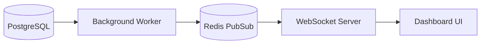

## Overview

The Business Intelligence module provides leadership with real-time visibility into every aspect of business performance, replacing spreadsheet reports with live, interactive dashboards.

## Key Features

### Executive Dashboard

At-a-glance view of critical metrics:

- Revenue (daily, weekly, monthly, YTD)
- Lead flow and conversion rates
- Sales team performance rankings
- Pipeline value and forecast

### Custom Report Builder

Drag-and-drop interface for creating custom reports:

- Multiple visualization types (charts, tables, gauges)
- Flexible date ranges and filters
- Scheduled email delivery
- Export to PDF/Excel

### Live KPI Tracking

Real-time metrics that update automatically:

```typescript
// Real-time KPI subscription
const kpiStream = useKPIStream({
  metrics: ['revenue', 'leads', 'appointments', 'sales'],
  interval: '1m',
  onUpdate: (data) => {
    dashboardStore.updateMetrics(data)
  },
})
```

### Trend Analysis

Historical comparisons and pattern detection:

- Year-over-year comparisons
- Seasonality analysis
- Growth rate calculations
- Anomaly detection

## Technical Implementation

### Data Architecture

Using materialized views for performant queries:

```sql
CREATE MATERIALIZED VIEW daily_revenue_summary AS
SELECT 
  date_trunc('day', closed_at) as date,
  COUNT(*) as deals_count,
  SUM(amount) as total_revenue,
  AVG(amount) as avg_deal_size,
  COUNT(*) FILTER (WHERE source = 'referral') as referral_count
FROM deals
WHERE status = 'won'
GROUP BY date_trunc('day', closed_at)
WITH DATA;

-- Refresh on schedule
CREATE INDEX ON daily_revenue_summary (date DESC);
```

### Caching Strategy

Multi-layer caching for sub-second dashboard loads:

1. **Materialized views**: Pre-computed aggregations in PostgreSQL
2. **Redis cache**: Hot data with TTL-based invalidation
3. **Client-side**: Pinia store with optimistic updates

### Real-time Architecture



## Impact

The BI module transformed decision-making:

- **Instant access** to metrics previously requiring manual compilation
- **Weekly time savings** of 10+ hours in report generation
- **Data-driven decisions** at every level of the organization
- **Early warning system** for performance issues

