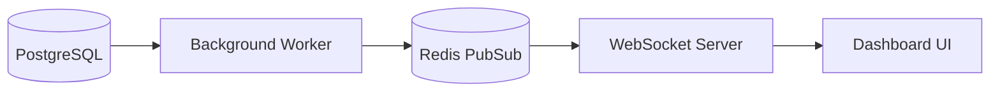

## Overview

The Business Intelligence module provides leadership with real-time visibility into every aspect of business performance, replacing spreadsheet reports with live, interactive dashboards.

## Key Features

### Executive Dashboard

At-a-glance view of critical metrics:

- Revenue (daily, weekly, monthly, YTD)
- Lead flow and conversion rates
- Sales team performance rankings
- Pipeline value and forecast

### Custom Report Builder

Drag-and-drop interface for creating custom reports:

- Multiple visualization types (charts, tables, gauges)
- Flexible date ranges and filters
- Scheduled email delivery
- Export to PDF/Excel

### Live KPI Tracking

Real-time metrics that update automatically via WebSocket subscriptions, with configurable refresh intervals and automatic reconnection handling.

### Trend Analysis

Historical comparisons and pattern detection:

- Year-over-year comparisons
- Seasonality analysis
- Growth rate calculations
- Anomaly detection

### Department Scorecards

Specialized scorecards for each business function:

| Scorecard | Key Metrics |
|-----------|-------------|
| **Branch** | Revenue, conversion rates, rep rankings per location |
| **Production** | Jobs in progress, completion rates, days outstanding |
| **Service** | Ticket volume, resolution time, customer satisfaction |
| **Telemarketing** | Calls made, appointments set, conversion rates |
| **Canvass** | Doors knocked, leads generated, rep performance |
| **Technology** | System health, API latency, error rates |

### Sales Reconciliation

Tools for ensuring data integrity:

- **Ghost Appointment Detection**: Find appointments without matching jobs
- **Split Integrity Checks**: Verify sales commission splits are correct
- **Data Reconciliation**: Compare CRM data against external sources

## CMO Dashboard (Separate Service)

A dedicated executive analytics platform with its own codebase:

- **Real-time KPI Visualization**: Live metrics updating in real-time
- **Cross-branch Performance**: Compare all 5 branches side-by-side
- **Marketing ROI Tracking**: Attribution for lead sources
- **Lead Source Attribution**: Track which marketing channels perform best
- **Revenue Forecasting**: Predictive analytics for planning

*The CMO Dashboard is a separate service that pulls from the same data sources, optimized for executive-level reporting without the operational features of the main BI module.*

## Technical Implementation

### Data Architecture

Heavy queries use PostgreSQL materialized views for pre-computed aggregations, refreshed on schedule to keep dashboards snappy while maintaining data freshness.

### Caching Strategy

Multi-layer caching for sub-second dashboard loads:

1. **Materialized views**: Pre-computed aggregations in PostgreSQL
2. **Redis cache**: Hot data with TTL-based invalidation
3. **Client-side**: Pinia store with optimistic updates

### Real-time Architecture

## Impact

The BI module transformed decision-making:

- **Instant access** to metrics previously requiring manual compilation
- **Weekly time savings** of 10+ hours in report generation
- **Data-driven decisions** at every level of the organization
- **Early warning system** for performance issues

