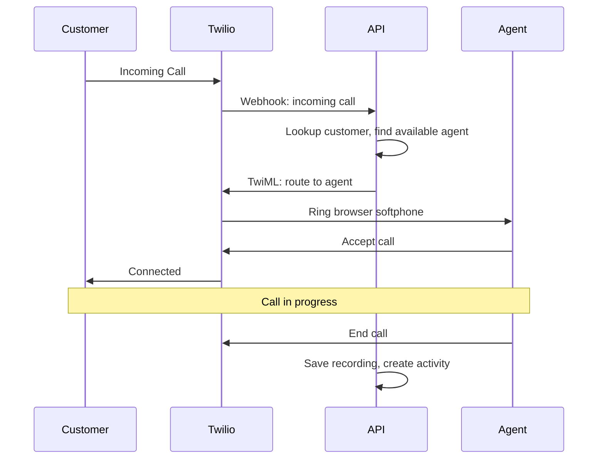

## Overview

The Call Center module transforms every computer into a powerful softphone, enabling sales reps and support staff to make and receive calls directly in their browser without additional hardware.

## Key Features

### Browser-Based Softphone

Complete phone functionality in the browser:

- Click-to-dial from any lead or customer record
- Incoming call routing with caller ID and customer lookup
- Transfer, hold, and conference calling
- Voicemail with transcription

### Call Recording & Transcription

Every call is automatically:

- Recorded and stored securely in S3
- Transcribed using speech-to-text
- Indexed for searchability
- Linked to the relevant customer record

### Quality Monitoring

Tools for managers to ensure call quality:

```typescript
// Quality scorecard structure
interface CallScorecard {
  callId: string
  agentId: string
  scores: {
    greeting: 1 | 2 | 3 | 4 | 5
    productKnowledge: 1 | 2 | 3 | 4 | 5
    problemResolution: 1 | 2 | 3 | 4 | 5
    professionalism: 1 | 2 | 3 | 4 | 5
    closing: 1 | 2 | 3 | 4 | 5
  }
  feedback: string
  coachingNotes: string
}
```

### Real-time Dashboard

Live visibility into call center operations:

- Active calls with duration
- Agent availability status
- Queue depth and wait times
- Historical metrics and trends

## Technical Architecture

### Twilio Integration

Using Twilio's Client SDK for browser-based calling:

```typescript
// Initialize Twilio Device
async function initializePhone() {
  const token = await fetchTwilioToken()
  
  device.value = new Twilio.Device(token, {
    edge: 'ashburn',
    closeProtection: true,
  })

  device.value.on('incoming', handleIncomingCall)
  device.value.on('disconnect', handleDisconnect)
  
  await device.value.register()
}

// Make outbound call
async function makeCall(phoneNumber: string, leadId: string) {
  const connection = await device.value.connect({
    params: {
      To: phoneNumber,
      LeadId: leadId,
    },
  })
  
  activeCall.value = connection
}
```

### Real-time State Synchronization

Redis PubSub for live updates across all agents:

```typescript
// Agent status updates broadcast to all subscribers
redisPublisher.publish('agent:status', JSON.stringify({
  agentId: user.id,
  status: 'on-call',
  callId: call.id,
  timestamp: Date.now(),
}))
```

### Call Flow



## Results

The Call Center module has transformed communication efficiency:

- **100% call capture**: No more missed calls or lost leads
- **3x faster** customer lookup with automatic caller ID matching
- **Quality improvements** through systematic call review
- **Complete audit trail** of all customer communications

