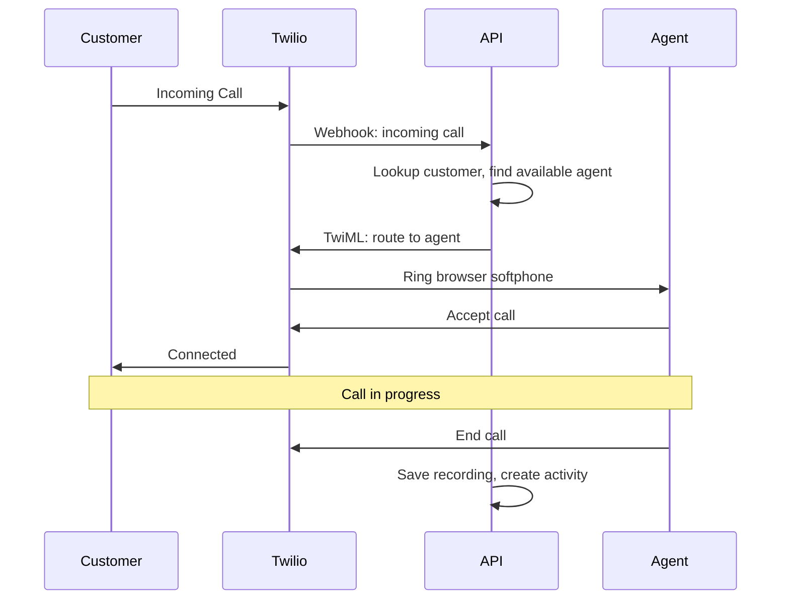

## Overview

The Call Center module transforms every computer into a powerful softphone, enabling sales reps and support staff to make and receive calls directly in their browser without additional hardware.

A key architectural decision was implementing **Convex** for real-time state management. With 9 dedicated Convex tables, the system handles agent availability, call queues, active calls, SMS threads, and contact tab synchronization—all with sub-second reactivity across all connected agents.

## Key Features

### Browser-Based Softphone

Complete phone functionality in the browser:

- Click-to-dial from any lead or customer record
- Incoming call routing with caller ID and customer lookup
- Transfer, hold, and conference calling
- Voicemail with transcription

### Call Recording & Transcription

Every call is automatically:

- Recorded and stored securely in S3
- Transcribed using speech-to-text
- Indexed for searchability
- Linked to the relevant customer record

### Quality Monitoring

Tools for managers to ensure call quality with structured scorecards covering greeting, product knowledge, problem resolution, professionalism, and closing—each rated 1-5 with feedback and coaching notes.

### Real-time Dashboard

Live visibility into call center operations:

- Active calls with duration
- Agent availability status
- Queue depth and wait times
- Historical metrics and trends

### SMS Platform

Two-way SMS messaging with real-time inbox:

- **Real-time Inbox**: Convex-powered message threads with instant updates
- **Thread Locking**: Prevents multiple agents from responding to same conversation
- **Canned Responses**: Pre-built templates for common scenarios
- **DNC Compliance**: Full audit trail for Do Not Call/Text with timestamps and source
- **Grammar Suggestions**: AI-powered writing assistance via Gemini

### AI-Powered Features

Leveraging Google Gemini and OpenAI for intelligent automation:

- **Call Audio Grading**: AI analyzes call recordings and scores agent performance
- **Agent Performance Summaries**: Automated insights on individual agent trends
- **Group Performance Analysis**: AI-generated reports on team metrics
- **Real-time Transcription**: Calls transcribed for searchability and review
- **Grammar Suggestions**: AI proofreads SMS messages before sending

## Convex Real-time Architecture

The call center uses Convex for all real-time state, with PostgreSQL as the permanent archive:

### 9 Convex Tables

| Table | Purpose |
|-------|---------|
| `agent_status` | Tracks agent availability (available/busy/away) |
| `incoming_call_queue` | Queue of incoming calls waiting for agents |
| `user_contact_tabs` | Persists open contact tabs across devices |
| `active_calls` | Prevents double-dial by tracking live calls |
| `call_queue` | "Next Call" queue for outbound campaigns |
| `transfer_queue` | Pending call transfers between agents |
| `agent_skills` | Skill-based routing for transfers |
| `sms_messages` | Hot storage for active SMS threads |
| `sms_thread_locks` | Real-time locking for conversation editing |

### Why Convex + PostgreSQL?

- **Convex**: Hot ephemeral state that needs sub-second reactivity
- **PostgreSQL**: Permanent archive, complex queries, reporting

```
New SMS → Postgres (archive) → Convex (hot) → Real-time UI
                                    ↓
                          Hydrate last 10 messages
```

## Technical Architecture

### Twilio Integration

The Twilio Voice SDK enables browser-based calling via WebRTC. Agents initialize a Device with JWT token authentication, register event handlers for incoming calls and disconnects, and can make outbound calls with custom parameters (phone number, lead ID) that flow through to webhooks.

### Real-time State Synchronization

Convex mutations provide instant updates across all connected agents. When one agent changes status or takes a call, all subscribed clients see the update immediately—no manual pub/sub required.

The hybrid architecture uses:
- **Convex**: Real-time state (agent status, call queue, SMS threads)
- **Ably**: Event broadcasting for specific notifications
- **PostgreSQL**: Permanent storage and complex reporting queries

### Call Flow



## Results

The Call Center module has transformed communication efficiency:

- **100% call capture**: No more missed calls or lost leads
- **3x faster** customer lookup with automatic caller ID matching
- **Quality improvements** through systematic call review
- **Complete audit trail** of all customer communications

